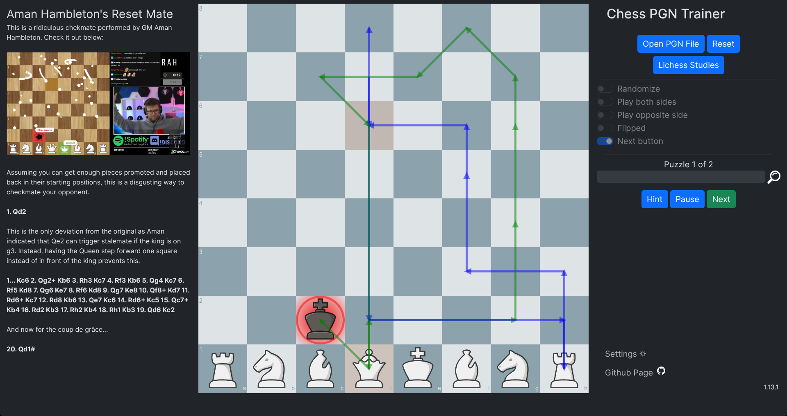
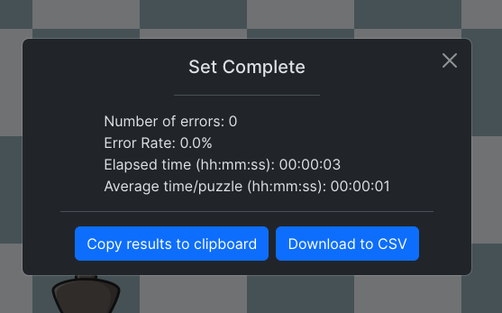

# Chess PGN Trainer
Online tool that opens chess PGN files and allows the user to practice the moves.  This tool is to help with drilling, ***as efficiently as possible***, a set group of puzzles/games in an appropriately configured PGN file. Once the set is complete, the player sees how many errors they made as well as how long the set took to complete.

The original design goal was to help with implementing a learning approach where a player repeatedly completes the same series of puzzles, striving to reduce both errors and time needed with each round.
The idea for this came from a recommendation by Dan Heisman (https://www.danheisman.com/recommended-books.html) on how to practice tactics puzzles.  In the article, Dan strongly recommends the idea of "repeatedly going through the book faster and faster until you can get 85%+ within 10-15 seconds". 

Since then, the tool has grown and can now be used to:
* Practice puzzles
* Practice openings for black or white
* Practice entire games (useful for learning full games or for playing solitaire chess such as "Guess the Move")

See the sample PGN files in the /examples folder for more information.  The samples include puzzles, openings for both white and black, as well as some famous games to practice.  

Also included is a PGN of a slighly modified [Aman Hambleton's reset mate](https://www.youtube.com/watch?v=XAlcDWQ6iTM) for those who want to practice that sequence along with the same sequence mirrored for black pieces.  The PGN also highlights some of the annotation features available including embedding a YouTube video as well as comments during the move sequence.

[A live online copy of tool is available here](https://rodpolako.github.io/)


## Features
This tool has a number of features that you might find useful:
* Auto move to next puzzle - Automatically advances to the next puzzle/game upon completion of the current one.  This can be disabled via the use of the "Next button" option.
* Play both sides - Allows the player to play both sides of the puzzle/game
* Randomize - Presents the puzzles/games in the set in a random order
* Flipped - Allows you to play the puzzle/game from the other side of the board.  May help to develop sense when a given tactic is being used on you.
* Play Opposite Side - Allows the player to go second instead and makes the computer play the first move from the PGN.  Useful for when you want to practice opening defenses instead of puzzles.  For example, if you wanted to practice a defense as black, load a PGN with the move order you want to practice and this feature will play as white and play the moves in the PGN while you play the response.  Recommended that you use the Flipped option in conjunction with this one.
* Analysis board - More useful for puzzles, this option generates a link to a Lichess analysis board of the currently displayed position. Useful when you want to analyze a specific puzzle during a run in order to analyze or troubleshoot.  This link will always be available via the magnifying glass next to the progress bar which if clicked will open an analysis board in Lichess in a new tab.
* Pause - Useful if you are doing a large number of puzzles/games and need to step away.  Click on the pause button and the board will clear and the timer will stop.  Click Resume in order to continue.  Your elapsed time will not include the paused time.
* Hints - You can press the hint button at any time during a puzzle/game to see the next expected move.  Just know that if a hint is used, it will be counted as an error in your performance.
* Restart/replay - You can repeat the current puzzle/game set upon completion with a single click. Useful if you want to try again with the same settings.  When the current set is complete, just click on "Restart" to try the current PGN file again.  If you want, you can choose different settings like random, flipped, etc. before restarting.
* Feature settings via PGN Tags - You can configure a PGN to set a default combination of features by adding the relevant tag to the top of the PGN.  Details below.
* Responsive design allows the app to be used in either portrait or landscape mode which means that it is able to be used on phones and tablets along with desktop.
* Choice of multiple piece designs - Note this will reset the board so don't change sets while in the middle of puzzle set.
* Ability to specify custom board colors either by manual entry or color picking 
* Dark mode  
* Ability to copy results to clipboard ready to paste into a spreadsheet such as Google Sheets or Microsoft Excel. 
* Ability to export results to CSV file along with setting to include the headers
* Ability to add additional piece sets (either PNG for SVG) for hosted instances only.  Not available on github.io page.
* Support for annotations - Comments in PGN files will display in the annotation panel to the left of the board.  Annotations can use HTML tags so the PGN comments can be fully featured with things like headings, bullets, bold, italics, links, thumbnails, video, etc. If present, annotations will display while completing the puzzle.  Board-level annotations, like circles and arrows is included and can be disabled via settings.  
**Note:** The annotation panel will only be available on screens wider than 992 pixels (1024 or higher recommended).
* Ability to set the piece movement speed
* Support for variations.  PGN files can have any number of variations within and the tool will treat each one as a separate puzzle.  This is useful for puzzles with multiple responses by the opponent as well as for practicing openings.  See the example PGN files for more information.
* Sound effects (move, capture, check, checkmate, and error).  By default these are turned off to prevent distraction but can be enabled in the Settings menu
* **Experimental** text to speech to have the computer say the moves.  It currently has an issue due to the speed of the computer moves where your move won't get said since the computer plays the next move immediately and that will cancel the current speech and start the next one.  Works fine when playing both sides.  By default it is also disabled.  Works best in Chrome.
* Integration with Lichess studies.  You can access your studies on Lichess and drill a chapter or an entire study directly without the need to download a pgn. See the [Wiki](https://github.com/rodpolako/Chess-PGN-Trainer/wiki#lichess-study-integration) on how exactly to use this feature.

## Setup Instructions
If you just want to use the trainer and and not bother hosting the page yourself, you can just use the live link [here](https://rodpolako.github.io/).  The latest version of the trainer will always be hosted there.

If you want to host a copy on your own environment and/or make changes:
1. Download & extract the zip into a folder and start a web server from there.
2. In a browser, point to ```index.html```.  On my own setup, the URL is ```localhost:8000/index.html``` but may be different for your setup.  Refer to your web server for details.

### Docker

To build the Docker image locally using the example Dockerfile, pull the git repository and use the following command:

```sh
docker build --no-cache -t chess-pgn-trainer -f ./docker/Dockerfile ./docker
```

This will build the Docker image with the latest version of the repository.

Once the image is built, you can run the container using the example docker-compose.yml file in the repository:

```sh
docker compose -f ./docker/docker-compose.yml up -d
```

Then navigate to http://your-server-ip:3000 in your browser to access the page.

## Usage
1. Click on "Open PGN File"
2. Navigate to the desired PGN file and then click on OK
3. Activate any desired features (such as random, flipped, play both sides)
4. When ready, click on start and the first puzzle in the set will be displayed and you can make your first move.
5. When the puzzle/game is finished, the next puzzle/game in the set will be automatically loaded. This is the default action unless you select the "next button" option.  If you used the "next button" option, click on the next button to proceed to the next puzzle.
6. When the set of puzzles/games is complete, your final stats will be displayed.
7. You can pause any time if you need to step away.
8. If you get stuck you can get a hint by clicking the hint button.

You can then start a new PGN file by repeating these steps.

Once a test group is completed, tool displays the following performance information:
* Number of errors
* Time to completion
* Average time per puzzle/game (Calculated)
* Error rate (Calculated)



## Documentation
See the [Wiki](https://github.com/rodpolako/Chess-PGN-Trainer/wiki) for a complete documentation.
